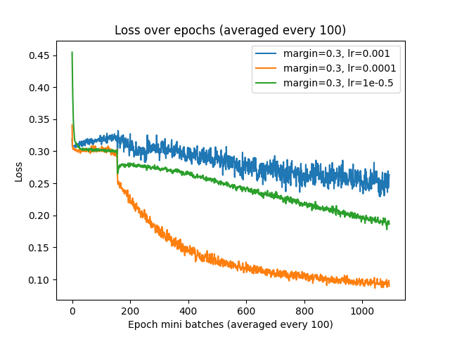
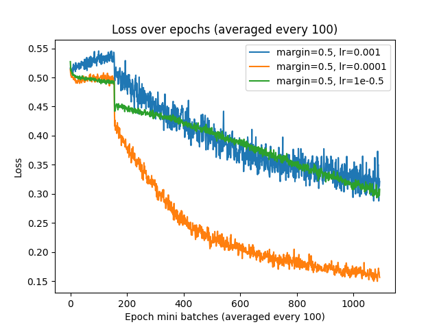
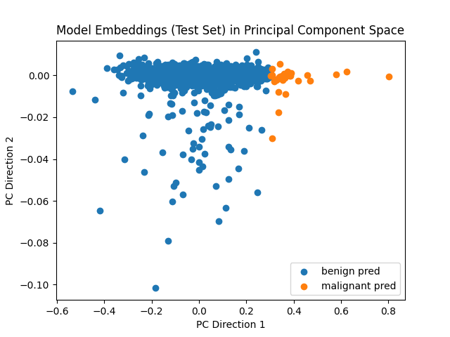
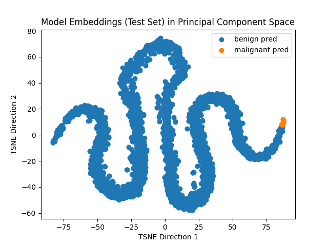
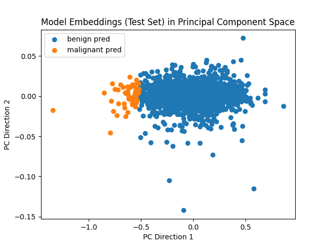
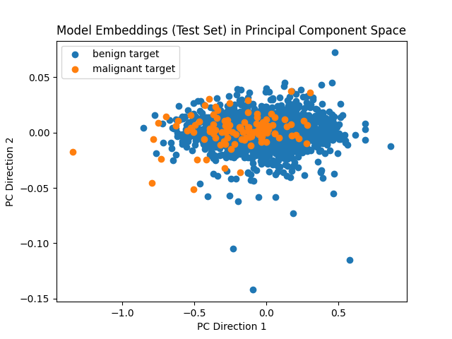
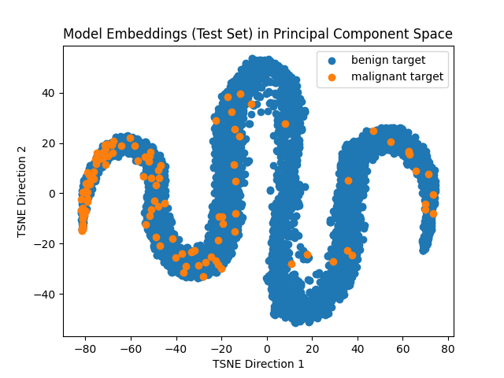

# Classifier for ISIC 2020 Kaggle Challenge based on a Siamese Network <!-- omit from toc -->

**Table of Contents**
- [Model and Problem Description](#model-and-problem-description)
- [Model Architecture](#model-architecture)
- [Dependencies and Reproducibility](#dependencies-and-reproducibility)
- [Model Usage](#model-usage)
- [Results](#results)
- [Training Details](#training-details)
- [References](#references)

## Model and Problem Description
A siamese network is a neural network that takes a pair of input vectors and produces output embeddings in a lower-dimensional space that can be used to compare the original inputs. The idea of a siamese network was first proposed for signature verification [2], but it has since been applied to facial recognition and verification problems [5], as well as pedestrian tracking via video surveillance [4]. The output embeddings can be compared via some distance metric (e.g. Euclidean distance or cosine similarity) to quantify the "closeness" of the original input pair. During prediction, one of the vectors in the pair has a known label and is used as a reference for the other vector so that it can be classified based on how similar it is to known labelled images.

In this project, we apply the siamese network architecture to skin lesion analysis, in particular the dataset from the ISIC 2020 Melanoma Classification Challenge [6]. The challenge is to identify the presence of melanoma, a deadly and rare skin cancer, in images of skin lesions.

## Model Architecture
The siamese network architecture consists of a pair of neural networks with shared weights. In this project, the so-called "sister" networks we use are ResNets [3], in particular ResNet50s. The key characteristic of residual networks are that the weight layers learn residual functions with respect to the layer inputs as opposed to unreferenced functions. They have been shown empirically to be easier to optimise, and can perform better with increased depth despite deeper neural networks being typically more difficult to train. The output from the ResNets are pass through a global average pooling layer and flattened before being downsampled via a series of fully connected layers to some lower-dimensional space. Once we have embeddings from both inputs in the pair, they can be compared via e.g. Euclidean distance. An example architecture can be seen below.


*Siamese network example architecture with a ResNet base [7].*

The ResNet50 implementation in PyTorch has an additional fully connected downsampling layer from 2048 down to 1000 features, which we remove and replace with our own fully connected layers afterwards.

One of the losses commonly used for siamese networks, and what we use in this project, is contrastive loss. Mathematically, this is given as

$$\mathbb{I}(y = 0) \cdot \Vert f(x_1) - f(x_2) \Vert_2^2 + \mathbb{I}(y = 1) \cdot \max(0, m - \Vert f(x_1) - f(x_2) \Vert_2^2 ),$$

where $\mathbb{I}(\cdot)$ is the indicator function, $y = 0$ if the pair is similar and $y = 1$ if they are dissimilar, $f(x_1)$ and $f(x_2)$ are the output embeddings from the pair $(x_1, x_2)$, and $m$ is the *margin*. The idea is as follows:
- For similar pairs, this is simply the squared distance between the output embeddings.
- For dissimilar pairs, the loss is 0 if the squared distance is less than the margin $m$. Otherwise, the smaller the squared distance, the greater the loss.

Intuitively, the network is penalised if two similar vectors are far away in the embedded space, or if two dissimilar vectors are close together in the embedded space. The margin is the threshold at which we start penalising via the loss, and typically the same margin is used when predicting to determine whether a pair is similar or dissimilar.

*As a side note, other Lp norms (and indeed other distance metrics) can also be used in place of the Euclidean norm.*

## Dependencies and Reproducibility
The full list of dependencies and exact versions can be found in [environment.yml](./environment.yml). The Conda environment can replicated using the following command:
```bash
conda env create -f environment.yml
```
Notably, the main dependencies we use are:
- [numpy](https://numpy.org/)
- [pandas](https://pandas.pydata.org/)
- [pytorch-metric-learning](https://kevinmusgrave.github.io/pytorch-metric-learning/)
- [scikit-learn](https://scikit-learn.org/)
- [torch](https://pytorch.org/)

Where possible, seeding has been used to ensure the reproducibility of results. In particular, the train/test/validation split and dataset creation steps support providing seeds so that the same splits can be created across multiple machines, and Pytorch's seed has been manually set so that training can be replicated.

## Model Usage

1. Download the data from [here](https://www.kaggle.com/datasets/nischaydnk/isic-2020-jpg-256x256-resized/data), and unzip it into a directory called `data/` in the top level. This is a downsized version of the original dataset with images of size 256x256. A stratified (i.e. equal proportion of benign vs. malignant images) train/test/validation split should then be created from `train-metadata.csv`, using the `create_train_test_split()` function in `src/dataset.py` like so:
    ```python
    # DATA_DIR points to data/, see src/util.py
    create_train_test_split(DATA_DIR)
    ```
2. Model training is done in [src/train.py](src/train.py). See `python src/train.py --help` for usage instructions. Relevant hyperparameters can be passed as command line arguments to the script. Checkpoint files are saved at every 10 epochs. For example, to train with 100 epochs, a learning rate of 0.0001, a batch size of 64, and store the output in the `output/` directory, use
    ```bash
    python src/train.py train -o "output/" -m 0.3 -e 100 -l 0.0001 -b 64
    ```
3. Model testing for computing metrics is also done in [src/train.py](src/train.py). The checkpoint file to be used should be specified, as well as the margin to use for contrastive loss (this should be the same value as was used during training). This produces a classification report (prceision, recall, f1-score, accuracy) based on the test dataset, as well as the test AUROC (area under receiver operating characteristic curve). For example, to test the model with margin 0.3 in the `output/` directory from the 100th epoch checkpoint, use
    ```bash
    python src/train.py test -o "output/" -m 0.3 --checkpoint-ts "checkpoint-epoch-100.pt"
    ```
4.  To use the model for predictions, use [src/predict.py](src/predict.py). Similarly, see `python src/predict.py --help` for usage instructions. A list of images to be classified can be passed as command line arguments, and the prediction (and prediction probability) and target will be printed for each image. For example, to do prediction on a set of images using the model with margin 0.3 from the 100th epoch checkpoint, use
    ```bash
    python src/predict.py -c output/checkpoint-epoch-100.pt -m 0.3 data/train-image/image/ISIC6024335.jpg ...
    ```

Some plotting functionality has also been provided in [src/util.py](src/util.py). These will be demonstrated below.

## Results

The train/test/validation split used was 70/20/10 respectively, which corresponds to approximately 23,000 training samples, 6,600 test samples, and 3,300 validation samples.

Below are the results from the models that performed the best. These models were trained for around 120 epochs on Rangpur (with training sessions split over several job runs). From empirical testing using the validation set, I found margins 0.3 and 0.5 to produce the best classification performance.

**Training and testing output**

We plot the loss curves from training several models with margins 0.3 and 0.5 and learning rates 0.001, 0.0001, and 0.00001. The loss was recorded at every mini-batch, so to keep the graphs less cluttered, each series of 100 losses was averaged.

Losses for models trained with margin 0.3 | Losses for models trained with margin 0.5
:-:|:--:
 | 

A summary of each model's performance is given below. The dataset is imbalanced, and so there are significantly more benign cases than there are malignant cases. Hence accuracy is not a reliable indicator of performance. Instead, we can look at other metrics like AUROC, precision, and recall.

The values for precision, recall, and F1-score are given per-class, i.e. (benign, malignant). The best attained metrics in each column are bolded.


| Model hyperparameters      | AUROC      | Precision        | Recall           | F1-score         |
| -------------------------- | ---------- | ---------------- | ---------------- | ---------------- |
| Margin = 0.3, lr = 0.001   | 0.8542     | (0.99, 0.10)     | (0.91, 0.57)     | (0.95, 0.17)     |
| Margin = 0.3, lr = 0.0001  | 0.7953     | (0.99, 0.14)     | (0.95, 0.41)     | (0.97, 0.21)     |
| Margin = 0.3, lr = 0.00001 | 0.8601     | (0.99, 0.08)     | **(0.86, 0.64)** | (0.92, 0.14)     |
| Margin = 0.5, lr = 0.001   | 0.8190     | (0.99, 0.12)     | (0.93, 0.50)     | (0.96, 0.19)     |
| Margin = 0.5, lr = 0.0001  | 0.7949     | **(0.99, 0.15)** | **(0.95, 0.52)** | **(0.97, 0.24)** |
| Margin = 0.5, lr = 0.00001 | **0.8818** | (0.99, 0.08)     | (0.87, 0.67)     | (0.93, 0.15)     |

Overall, a margin of 0.5 and a learning rate of 0.0001/0.00001 seem to perform the best across both classes. As expected, each model performs very well on the benign cases, but struggles more with the malignant cases. Notably, the precision for malignant cases is quite poor across the board, but the recall is somewhat more reasonable in the best cases.

We can also visualise the embeddings in a lower-dimensional space using PCA and TSNE by comparing the predicted classes vs. the ground truth labels. For the PCA target plots (right), some clustering of malignant points is evident, but it is difficult to see any separation between benign and malignant cases. For the TSNE target plots (right), there is some malignant clustering evident around one of the tails, but again little separation between benign and malignant cases.

Predictions (margin 0.3) | Ground truth (margin 0.3)
:-:|:--:
 | 
 | 

Predictions (margin 0.5) | Ground truth (margin 0.5)
:-:|:--:
 | 
 | 

Using the [src/predict.py](src/predict.py) script, the trained model checkpoints can be used to make predictions on any given skin lesion images. Here are some example correct and incorrect predictions, using the model trained with margin 0.5 and learning rate 0.0001:

```
ISIC_6024335:
  Prediction: malignant (0.5512)
  Target    : malignant
ISIC_2600152:
  Prediction: benign (0.6772)
  Target    : benign
ISIC_2822718:
  Prediction: benign (0.6614)
  Target    : malignant
ISIC_7798403:
  Prediction: malignant (0.5354)
  Target    : benign
```

## Training Details

Below are some details and insights from the training process.

- The training data was preprocessed by randomly applying any one or multiple of horizontal flips, random crops, and random rotations. This allows even the same images to be slightly different when resampled multiple times. Random transforms have been shown empirically to be effective for reducing overfitting and improving generalisation [1].
- A per-class sampler was used to ensure that an equal proportion of positive and negative pairs were sampled in each mini-batch. Since the dataset is imbalanced with many more benign images than malignant images, this means that some images may be sampled multiple times during training.
- Contrastive loss was used as described above.
- The Adam optimiser was used with varying learning rates, as shown above.
- Miners were experimented with to select the hardest pairs to classify during training. However, from my experience they were not very effective, and tended to stagnate training.
- While training models for longer tended to decrease the loss steadily, the performance (measured via precision, recall, and AUROC) tended to also get worse. Accuracy tended to get better, but as discussed, is not a good representation of model performance for this dataset.
- When classifying unseen images, I experimented with using KNN with the embeddings of the reference images as neighbouring points. This was not very effective. In my experience, a better classifier was a "majority vote" classifier (implemented in the code as `MajorityClassifier`), which pairs an unseen image to all reference images, uses the margin as a threshold to compute its similarity/dissimilarity from each reference image, and classifies it based on the majority vote. This is very similar to KNN, but a key difference is that it explicitly uses the margin during classification, which I believe is what made it more effective.

## References

- [1]: Altarabichi, M. G.; Nowaczyk, S.; Pashami, S; Mashhadi, P. S.; Handl, J. (2024). [Rolling the dice for better deep learning performance: A study of randomness techniques in deep neural networks](https://www.sciencedirect.com/science/article/pii/S0020025524004134)
- [2]: Bromley, J.; Guyon, I.; LeCun, Y.; Säckinger, E.; Shah, R. (1994). ["Signature verification using a "Siamese" time delay neural network"](https://papers.neurips.cc/paper_files/paper/1993/file/288cc0ff022877bd3df94bc9360b9c5d-Paper.pdf).
- [3]: He, K.; Zhang, X.; Ren, S.; Sun, J. (2015). [Deep Residual Learning for Image Recognition](https://arxiv.org/abs/1512.03385).
- [4]: Leal-Taixé, L.; Canton-Ferrer, C., and Schindler, K. (2016). ["Learning by tracking: Siamese CNN for robust target association"](https://www.ethz.ch/content/dam/ethz/special-interest/baug/igp/photogrammetry-remote-sensing-dam/documents/pdf/learning-tracking-siamese.pdf).
- [5]: Taigman, Y.; Yang, M.; Ranzato, M.; Wolf, L. (2014). ["DeepFace: Closing the Gap to Human-Level Performance in Face Verification"](https://www.cs.toronto.edu/~ranzato/publications/taigman_cvpr14.pdf).
- [6]: [ISIC 2020 Melanoma Classification Challenge](https://www.kaggle.com/c/siim-isic-melanoma-classification/overview).
- [7]: [Siamese network architecture figure](https://www.researchgate.net/figure/Siamese-Networks-the-architecture-of-a-single-sister-network-It-consists-of-a-ResNet_fig3_354597739).
